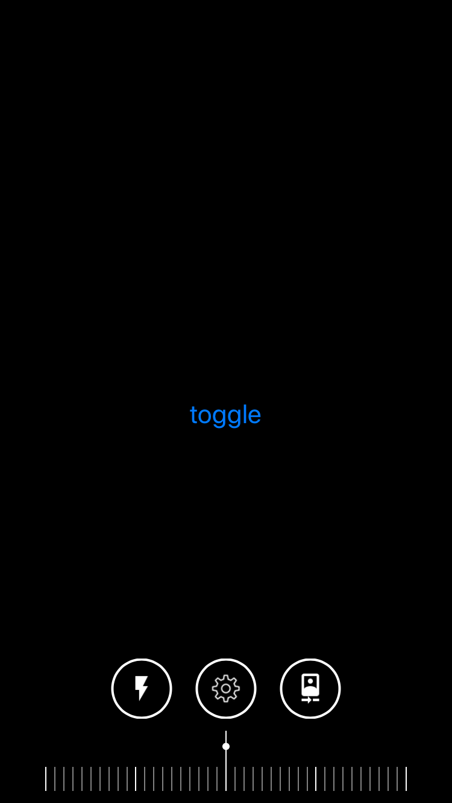
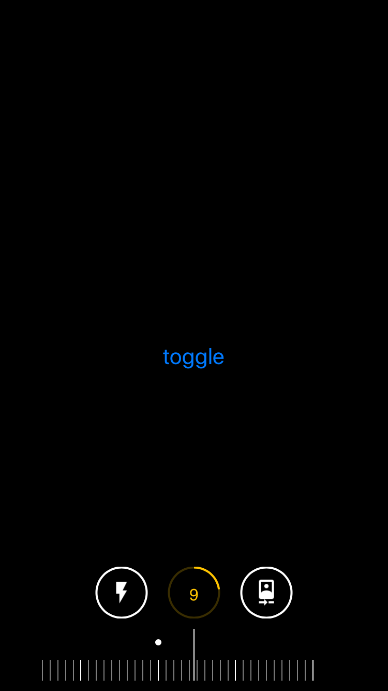
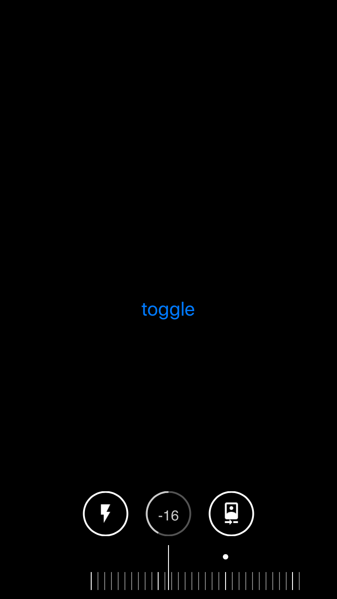
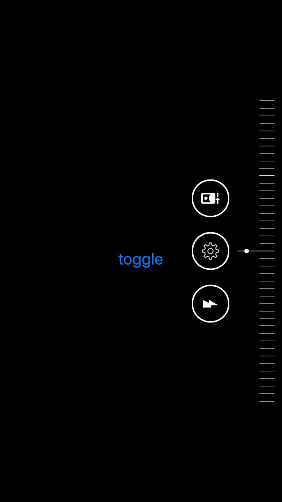

# Inchworm

#Inchworm

A rule-style UI tool for adjusting values

<p align="center">
    
</p>

<p align="center">
    
    
    
    
</p>

## Requirements
* iOS 11.0+
* Xcode 10.0+

### CocoaPods

```ruby
pod 'Inchworm', '~> 0.1'
```

## Usage

* create a DialBoard

``` swift
let model1 = ProcessIndicatorModel(limitNumber: 30,
                                   normalIconImage: UIImage(named: "ic_flash_on")!.tinted(with: UIColor.white)!.cgImage!,
                                   dimmedIconImage: UIImage(named: "ic_flash_on")!.tinted(with: UIColor.gray)!.cgImage!)

let model2 = ProcessIndicatorModel(limitNumber: 40,
                                   normalIconImage: UIImage(named: "settings")!.tinted(with: UIColor.white)!.cgImage!,
                                   dimmedIconImage: UIImage(named: "settings")!.tinted(with: UIColor.gray)!.cgImage!)

let model3 = ProcessIndicatorModel(limitNumber: 20,
                                   normalIconImage: UIImage(named: "ic_camera_front")!.tinted(with: UIColor.white)!.cgImage!,
                                   dimmedIconImage: UIImage(named: "ic_camera_front")!.tinted(with: UIColor.gray)!.cgImage!)


let modelList = [model1, model2, model3]

let board = createDialBoard(config: <Your Config>, frame: <Your Frame>, processIndicatorModels: modelList, activeIndex: 1)
```


<div>Icon used here is from <a href="https://www.flickr.com/photos/andreaskay/47331947062" title="Flickr">Flickr</a>. by Andreas Kay, is licensed by <a href="https://creativecommons.org/licenses/by-nc-sa/2.0/" title="Attribution-NonCommercial-ShareAlike 2.0 Generic" target="_blank">CC BY-NC-SA 2.0</a></div>
